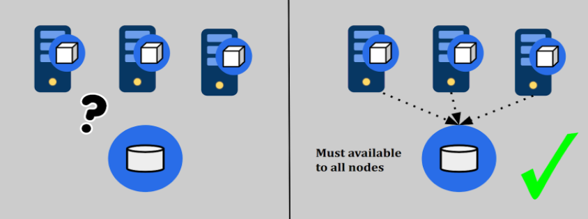
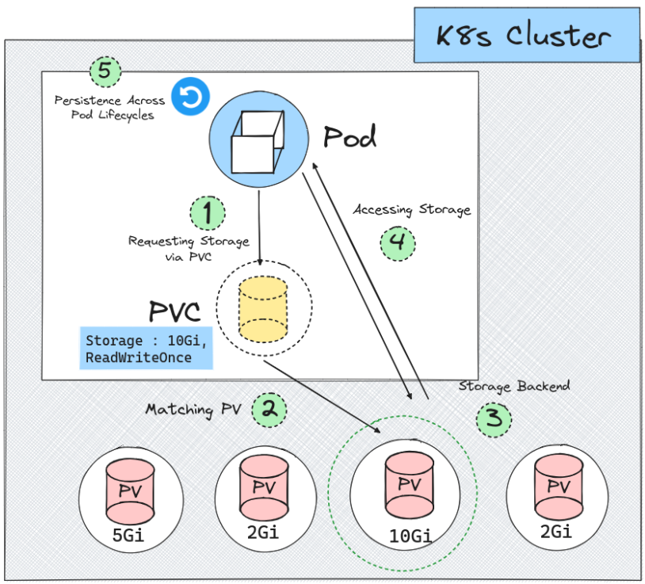
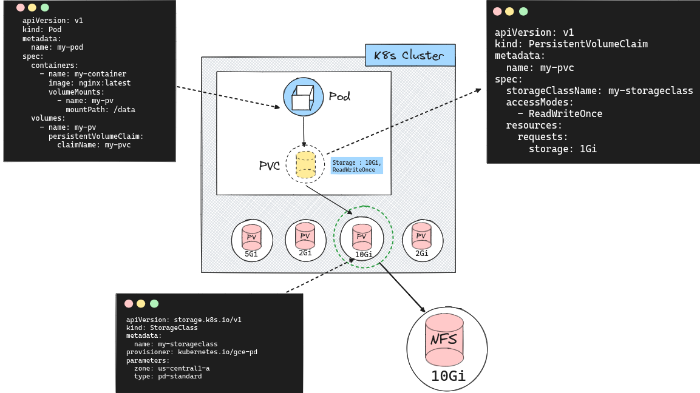
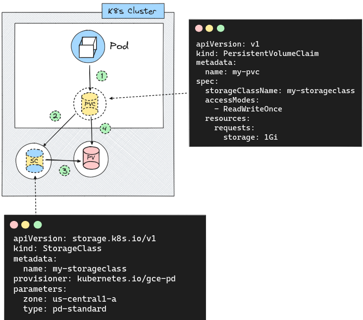

**Author:** Goutam Verma (Salad Technologies)

# **Introduction **

Kubernetes offers robust tools for ensuring containers are always available, but guaranteeing high availability for applications requires more. Traditional backup methods are not well-suited to protect against data loss in Kubernetes because they struggle to adapt to Kubernetes' dynamic nature. This is because Kubernetes introduces new complexities in both computing and storage, demanding a fresh perspective on data protection. To secure your data effectively, it's crucial not only to grasp 'how' Kubernetes operates but also to understand 'why' it functions as it does and how data is stored and managed within its framework. 

Without proper Kubernetes storage solutions, your application's data faces the risk of being lost during routine pod restarts. This can pose significant challenges, particularly for applications that require persistent data storage, such as databases and web applications. To address these issues and ensure data durability, Kubernetes provides various types of storage options. These storage solutions are essential for maintaining data integrity, enabling applications to securely store and retrieve data, and ensuring data survival throughout the lifecycle of containers and pods.


## **Types of Storage**


* Persistent Volumes
* Projected Volumes
* Ephemeral Volumes

Persistent Volumes : Persistent volumes refers to storage that exists independently of the pod's lifecycle. It is not tied to a specific node and can survive pod restarts, rescheduling, or even cluster node failures. Persistent storage is designed for storing data that needs to be retained and made available even when the pod is terminated or moved to a different node. Use cases for persistent storage include databases, application configuration files, and any data that requires durability and persistence.

Projected Volumes: Projected volumes are a feature that allows you to combine and project multiple sources of data into a single volume accessible to containers within a pod. These sources can include host directories, ConfigMaps, and Secrets. Projected volumes provide a way to share data among containers within the same pod or make data available to the host node. They are useful when you need to mount multiple pieces of data into containers for sharing or configuration purposes.

Ephemeral storage refers to temporary storage within a Kubernetes pod that is tightly bound to the lifecycle of that pod. It exists only as long as the pod is running on a specific node. Once the pod is deleted, or if it's rescheduled to another node, any data stored in ephemeral storage is lost. Ephemeral storage is typically used for transient or disposable data, such as logs or temporary scratch files, that doesn't need to be preserved beyond the pod's runtime.


## **Root Directory Structure**

Let's take a look into the fundamental root directory structure of cluster components. This structure provides a foundational understanding of how key elements within a Kubernetes cluster are organized and interact. 


## **How to persist data in K8s using volume**

Before delving into storage, let's consider a scenario where we have pods interacting with a database and performing read/write operations. In this context, we require storage that remains available regardless of the pod's lifecycle. This ensures that the data persists even when a pod terminates, and new pods take over seamlessly, picking up where the previous one left off. These new pods should be able to read existing data from the storage and synchronize themselves to become up-to-date. It's essential that this storage is accessible from all nodes within the Kubernetes cluster, not limited to a specific node.

For this storage requirements looks like :


* Storage does not depends on the Pod LifeCycle
* Storage must be available on all node
* Storage needs to survive even if cluster crashes 




In favor to create  the persistent volume, it create just like any other component get create using yaml


* Create as cluster resource
* Created via YAML file
    * Kind: persistent volume
    * Spec: How much storage is required

Persistent volumes need actual storage, such as local disks, external interface servers, or cloud storage. Now the question is, Where does this storage backend come from, and how do you make it available to the cluster? 

Kubernetes doesn't care about the actual storage, it gives you a PersistentVolume as an interface to the actual storage. As a maintainer or administrator, you have to take care and need to decide what type of storage you need: local or remote. It's important to think of storage in Kubernetes as an external plugin to your cluster whether is a local storage or cloud storage.


## **Persistent Volume YAML Example**

By creating Persistent Volumes (PVs), you can utilize actual physical storage. In the PV specification section, you define the storage backend you want to use to create that storage abstraction or resource for applications.

Persistent volumes are the resources and they need to be there before the pod is created. In order to make it available you need to follow steps


* Configure storage in cluster
* Create PV component from storage backend 
* Create explicit configure YAML to use those PV component or claim that volume using PersistentVolumeClaim (PVC)

Here's an example where we use an NFS storage backend. Essentially, specify how much storage is required and provide additional parameters, such as whether it should be read-write or read-only, among other access options.


```
apiVersion: vl
kind: PersistentVolume
metadata:
  name: pv-name
spec:
  capacity:
    storage: 10Gi  //Define how much storage you require
    VolumeMode: Filesystem 
    accessModes:
      - ReadWriteOnce //Define the access mode
    persistentVolumeReclaimPolicy: Recycle 
    storageClassName: slow 
    mountOptions:
      - hard
      - nfsvers=4.0
    Nfs: //Define NFS parameters
      path: /dir/path/on/nfs/server 
      server: nfs-server-ip-address

```


_Note : Depending on the storage type in the backend, some attributes in the specification will vary because they are specific to the storage details. In the official [Kubernetes documentation](https://kubernetes.io/docs/concepts/storage/volumes/#volume-types), you can find a comprehensive list of over 25 storage backends that Kubernetes supports._

Let’s take a look at workflow of persistent volume:




Step 1 : Requesting Storage Through a Claim: Users request storage resources by creating a Persistent Volume Claim (PVC) a YAML file. Within the PVC, they specify the desired storage capacity and additional characteristics like read-only or read-write access.(see fig 3)

Step 2: Finding the Matching Persistent Volume(PV): The PVC goes on a quest to find a suitable match within the Kubernetes cluster. It searches for a Persistent Volume (PV) that can fulfill the claim's requirements. Each PV represents an actual storage backend.(see fig 2)

Step 3: The Actual Storage Backend: Once a matching PV is identified, it represents the actual storage backend. The PV serves as an interface to create the storage resource needed. With the PV connected through the PVC, the storage is mounted into the pod. Think of this as the pod level, where the entire pod benefits from this storage connection.

Step 4: Accessing Storage within Containers: Inside the pod, which can have one or more containers, the volume is made available. Users can decide whether to mount this volume in all containers or just specific ones. Now, the application within the container can read from and write to this storage resource as needed. This level represents the container and application inside it.

Step 5: Persistence Across Pod Lifecycles: Importantly, if the pod were to terminate for any reason, when a new one gets created, it will inherit access to the same storage. This ensures continuity, allowing the new pod to see all the changes made by the previous pod or its containers.




_Note: Claims and pods must exist within the same namespace, but persistent volumes are not namespace-specific. This means claims are used to find volumes within the same namespace as the pod, ensuring proper isolation and resource management._


## **StorageClass**

Now, we've seen that in Kubernetes, administrators configure storage for the cluster, creating Persistent Volumes (PVs). Developers can then claim these volumes using Persistent Volume Claims (PVCs). However, imagine a scenario with a cluster hosting hundreds of applications, where new deployments occur daily, each requiring storage resources. In such a situation, developers would need to request administrators to manually create hundreds of PVs for all these applications, which can be a time-consuming, and potentially messy process.

To streamline this workflow and make it more efficient, Kubernetes introduces a third component of its persistence strategy called "**StorageClass**"  A StorageClass in Kubernetes is primarily responsible for dynamically creating or provisioning Persistent Volumes (PVs) when a Persistent Volume Claim (PVC) is made. This automation streamlines the process of creating and provisioning volumes in a cluster.

To create a StorageClass, you use a YAML configuration file, similar to other Kubernetes resources. In this example, we specify the kind as "StorageClass." The key attribute in a StorageClass configuration is the _provisioner._ The provisioner specifies which provisioner Kubernetes should employ to create the PV. This choice is based on the storage platform or cloud provider you are using.


```
apiVersion: storage.k8s.io/v1
kind: StorageClass
metadata:
    name: storage-class-name
provisioner: kubernetes.io/aws-ebs
parameters:
    type: iol
    topsPerGB: "10"
    fsType: ext4
```


It's essential to note that each storage backend typically has its own provisioner, which Kubernetes provides internally. These internal provisioners are prefixed with "_kubernetes.io_" like the one shown here in the above example. However, for other storage types or custom setups, external provisioners may be necessary. These external provisioners must be explicitly selected and integrated into your StorageClass configuration.

To use StorageClass in a pod configuration, you follow these steps:


* Pods Need Storage: When a Pod needs storage in Kubernetes, it doesn't directly ask for it. Instead, it uses something called a PersistentVolumeClaim (PVC) to make the request.
* PVC Request: In your PVC configuration, you add an attribute called storageClassName. This attribute tells Kubernetes which StorageClass to use for creating a PV that matches the PVC's needs. The storageClassName attribute is required in the PVC configuration. This attribute tells Kubernetes which StorageClass to use to provision a PersistentVolume (PV) that meets the requirements of the PVC.
* Claiming Storage: When a Pod is created and mentions a PVC, Kubernetes takes care of the request. It automatically asks for the storage you specified in the PVC from the chosen StorageClass. Think of it as Kubernetes doing the asking on behalf of the Pod.
* Automatic Provisioning: The StorageClass uses the provisioner specified in its configuration to create a PV that aligns with the PVC's requirements. This PV serves as the bridge to the actual storage backend.





In conclusion, StorageClass in Kubernetes is a fundamental component that allows users to dynamically provision and manage storage resources for their applications. Now that we have covered StorageClass, let's delve into the eight key storage principles in Kubernetes. These principles are essential for understanding how storage works within a Kubernetes cluster and how to effectively manage and utilize storage resources for your applications.
