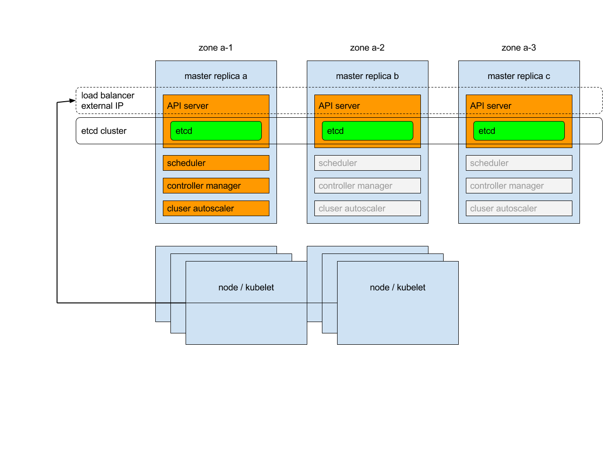

---
assignees:
- jszczepkowski

---

* TOC
{:toc}

## Introduction

In kubernetes version 1.5, we added alpha support for replication of kubernetes masters in kube-up/down scripts for GCE.
This document describes how to use kube-up/down scripts to manage highly available (HA) masters and how HA masters are implemented for GCE case.

## Running HA cluster on GCE

### Starting HA-compatible cluster

When creating a new HA cluster, two flags need to be set for kube-up script:

* `MULTIZONE=true` - to prevent removal of master replicas kubelets from zones different than server's default zone.
Required if you want to run master replicas in different zones, which is recommended.

* `ENABLE_ETCD_QUORUM_READS=true` - to ensure that reads from all API servers will return most up-to-date data.
If true, reads will be directed to leader etcd replica.
Setting this value to true is optional: reads will be more reliable but will also be slower.

In addition, we may specify in which GCE zone the first master replica will be created by setting:

* `KUBE_GCE_ZONE=zone` - zone where the first master replica will run.

The sample command to set up the HA-compatible cluster:

```
$ MULTIZONE=true KUBE_GCE_ZONE=europe-west1-b  ENABLE_ETCD_QUORUM_READS=true ./cluster/kube-up.sh
```

Please note that execution of the comments above will create a cluster with one master,
but the cluster will allow adding a new master replicas in future.

### Adding a new master replica

After creation of HA-compatible cluster, we should add some master replicas to it.
Creation of a master replica is also done by kube-up script with the following flags:

* `KUBE_REPLICATE_EXISTING_MASTER=true` - to create a replica of an existing
master.

* `KUBE_GCE_ZONE=zone` - zone where the master replica will run.
Should be in the same region as other replicas' zones.

* you don't need to set `MULTIZONE` or `ENABLE_ETCD_QUORUM_READS` flags as they values will be inherited from already running clusters
(we assume that the flag were set during starting HA-compatible cluster).

The sample command:

```
$ KUBE_GCE_ZONE=europe-west1-c KUBE_REPLICATE_EXISTING_MASTER=true ./cluster/kube-up.sh
```

### Removing master replica

A master replica may be removed using kube-down script with the following flags:

* `KUBE_DELETE_NODES=false` - to restrain deletion of kubelets.

* `KUBE_GCE_ZONE=zone` - the zone from where master replica will be removed.
 
* `KUBE_REPLICA_NAME=replica_name` - (optional) the name of master replica to remove.
If empty: any replica from the given zone will be removed.

The sample command:

```
$ KUBE_DELETE_NODES=false KUBE_GCE_ZONE=europe-west1-c ./cluster/kube-down.sh
```

### In case of replica failure

If one of master replica in cluster is broken, we should remove it and add a
new replica in the same zone. The sample commands:

1. Remove the broken replica:

```
$ KUBE_DELETE_NODES=false KUBE_GCE_ZONE=replica_zone KUBE_REPLICA_NAME=replica_name ./cluster/kube-down.sh
```

2. Add a new replica in place of the old one:

```
$ KUBE_GCE_ZONE=replica-zone KUBE_REPLICATE_EXISTING_MASTER=true ./cluster/kube-up.sh
```

### Deployment best practices

* Try to place master replicas in different zones. During a zone failure, all master placed inside the zone will fail.
o prevent zone failure, also place nodes in  multiple zones
(see [multiple-zones](http://kubernetes.io/docs/admin/multiple-zones/) for details).  
* Do not use cluster with two master replicas. Consensus on a two replica cluster requires both replicas running when changing persistent state.
So, both replicas are needed and a failure of any replica turns cluster into majority failure state.
Such two replica setup is worse in terms of HA than a single replica setup.

* During addition of a master replica, cluster state (etcd) is copied to a new instance.
If the cluster is large, it may take a long time to duplicate its state.
This operation may be speed up by migrating etcd data directory, as described [here](https://coreos.com/etcd/docs/latest/admin_guide.html#member-migration) here
(we are considering adding support for etcd data dir migration in future).

## Implementation notes



### Overview

Each of master replicas will run the following components in the following mode:

* etcd instance: all instances will be clustered together using consensus;

* API server: each server will talk to local etcd - all API servers in the cluster will be available;

* controllers, scheduler, and cluster auto-scaler: will use lease mechanism - only one instance of each of them will be active in the cluster;

* add-on manager: each manager will work independently trying to keep add-ons in sync.

In addition, there will be a load balancer in front of API servers that will route external and internal traffic to them.

### Load balancing

When starting the second master replica, a load balancer containing the two replicas will be created
and the IP address of the first replica will be promoted to IP address of load balancer.
Similarly, when after removal of a master replica, only one replica will remain,
the load balancer will be removed and its IP address will be assigned to the last remaining replica.
Please note that creation and removal of load balancer are complex operations and it may take some time (~20 minutes) for them to propagate.

### Master service & kubelets

Instead of trying to keep up-to-date list of kubernetes apiserver in kubernetes service, we will direct all traffic to the external IP:

* in one master cluster the IP points to the single master,

* in multi-master cluster the IP points to the load balancer in-front of the masters.

Similarly, the external IP will be used by kubelets to communicate with master.

* Master certificates

Master TLS certificates will be generated for the external public IP (of the load balancer) and local IP of each replica.
There will be no certs for ephemeral public IP of replicas.
So, accessing them using ephemeral public IP will be possible only when skipping TLS verification.

* Clustering etcd

To allow etcd clustering, ports needed to communicate between etcd instances will be opened (for inside cluster communication).
To make such deployment secure, communication between etcd instances is authorized using SSL.

## Future reading

[Automated HA master deployment - design doc](https://github.com/kubernetes/kubernetes/blob/master/docs/design/ha_master.md)

